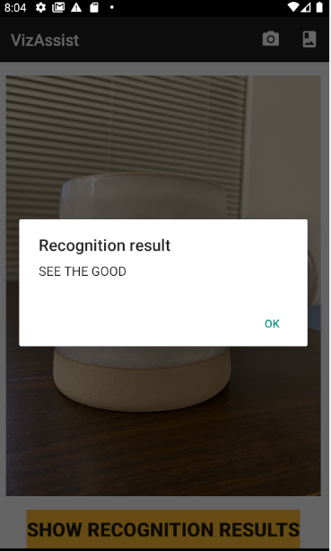

# VizAssist
A reading assistant Android app for the visually impaired to capture or select an image and obtain the transcribed text. With TalkBack, the app reads the transcribed text aloud.   
The backend web service annotates the uploaded image using Google Cloud Vision OCR.

The AndroidApp folder is the Android app using AndroidStudio.  
The Service folder is the cloud OCR service using Eclipse.

Here are the screenshots of the app showing the uploaded image and the transcribed text respectively.  
 